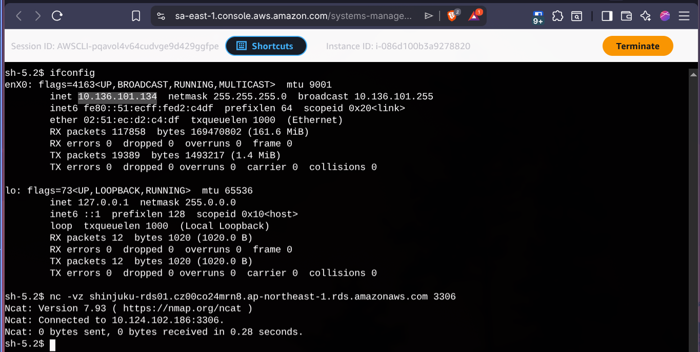

What you should “feel” conceptually (the words that stick)

The compliance truth
    PHI storage stays in Tokyo
    Compute can move
    Access can be global
    Storage cannot

The engineering truth
    TGW makes a controlled corridor
    CloudFront keeps a single URL
    São Paulo is stateless
    Tokyo is authoritative

That’s the whole lab.
    ....for now....  you can always be a man.....

Quick verification commands (so they can prove it)
From São Paulo EC2 (SSM session)

Test network reachability to Tokyo RDS:

    nc -vz <tokyo-rds-endpoint> 3306
    
```
sh-5.2$ nc -vz shinjuku-rds01.cz00co24mrn8.ap-northeast-1.rds.amazonaws.com 3306

```

Then app-level verification:
  submit record in São Paulo
  confirm it appears when calling the Tokyo region (same data, one DB)

Confirm routes (AWS CLI)
For each region, verify route tables include the cross-region CIDR to TGW:

    aws ec2 describe-route-tables --filters "Name=vpc-id,Values=<VPC_ID>" --query "RouteTables[].Routes[]"

Tokyo
aws ec2 describe-route-tables --filters "Name=vpc-id,Values=vpc-06e92d0c1693d046b" --query "RouteTables[].Routes[]"
```
[
    {
        "DestinationCidrBlock": "10.124.0.0/16",
        "GatewayId": "local",
        "Origin": "CreateRouteTable",
        "State": "active"
    },
    {
        "DestinationCidrBlock": "10.124.0.0/16",
        "GatewayId": "local",
        "Origin": "CreateRouteTable",
        "State": "active"
    },
    {
        "DestinationCidrBlock": "0.0.0.0/0",
        "GatewayId": "igw-0582812627d2eb393",
        "Origin": "CreateRoute",
        "State": "active"
    },
    {
        "DestinationCidrBlock": "10.124.0.0/16",
        "GatewayId": "local",
        "Origin": "CreateRouteTable",
        "State": "active"
    },
    {
        "DestinationCidrBlock": "10.136.0.0/16",
        "TransitGatewayId": "tgw-03610cef2749c7c2a",
        "Origin": "CreateRoute",
        "State": "active"
    },
    {
        "DestinationCidrBlock": "0.0.0.0/0",
        "NatGatewayId": "nat-0538bcb5aa10c1bd0",
        "Origin": "CreateRoute",
        "State": "active"
    },
    {
        "DestinationPrefixListId": "pl-61a54008",
        "GatewayId": "vpce-09b86e88f4f7296dd",
        "Origin": "CreateRoute",
        "State": "active"
    }
]
```

Sao Paulo
aws ec2 describe-route-tables --filters "Name=vpc-id,Values=vpc-0a4ec8ccf1c263af2" --query "RouteTables[].Routes[]"

Suggested structure for the student repo
/tokyo/ = “Lab2 + marginal TGW hub code”
/saopaulo/ = “Lab2 minus DB + TGW spoke code”

  outputs.tf in Tokyo exports:
      tokyo_vpc_cidr
      tokyo_tgw_id
      tokyo_rds_endpoint

São Paulo consumes those outputs (remote state) to configure routes and SG rules
